# Advanced Programming A20 - BidMart

## Group Software Architecture - Tutorial 09 - B

## Anggota Kelompok
- Daffa Abhinaya Avesinanoor - 2406405720 - Katalog dan Manajemen Listing
- Dimas Abyan Diasta - 2406432633 - Autentifikasi dan Manajemen Pengguna
- Muhammad Azka Awliya - 2406431510 - Lelang dan Penawaran
- Refki Septian - 2406397196 - Manajemen Dompet dan Saldo

---

## Bagian 1 - Current Architecture

### 1.1 System Context Diagram
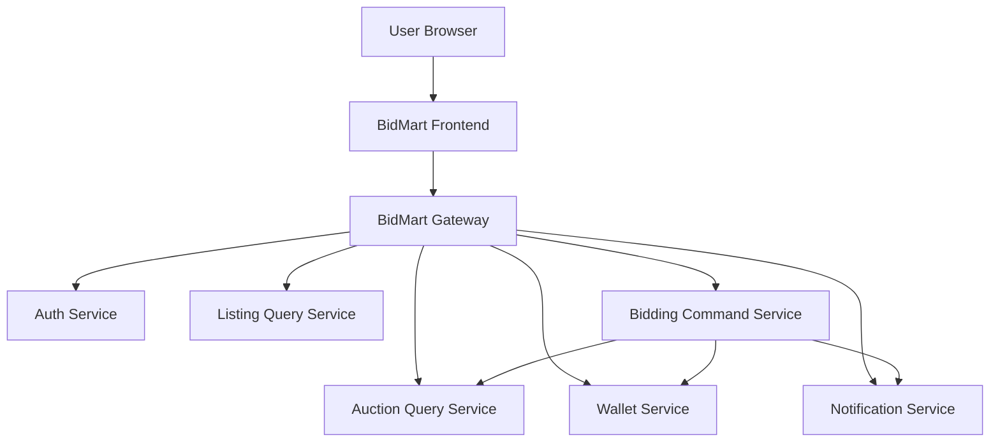
```mermaid
flowchart TB
    U["User Browser"] --> FE["BidMart Frontend"]
    FE --> GW["BidMart Gateway"]

    GW --> AUTH["Auth Service"]
    GW --> LQS["Listing Query Service"]
    GW --> AQS["Auction Query Service"]
    GW --> BCS["Bidding Command Service"]
    GW --> WLT["Wallet Service"]
    GW --> NTF["Notification Service"]

    BCS --> WLT
    BCS --> AQS
    BCS --> NTF
```

### 1.2 Container Diagram
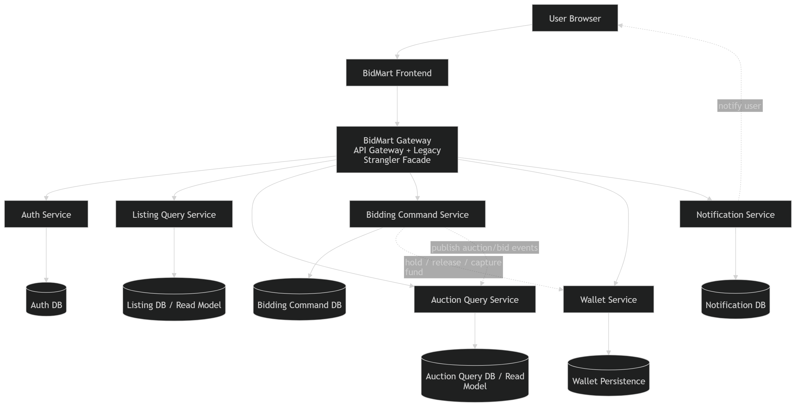

### 1.3 Deployment Diagram
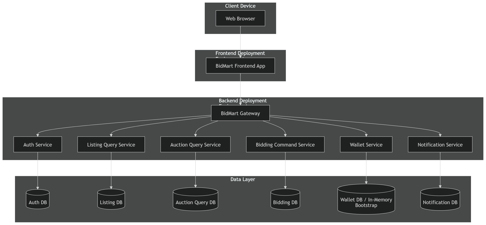

---

## Bagian 2 - Expected New Future Architecture

### 2.1 Arsitektur Future yang Diharapkan
Target arsitektur baru berfokus pada pengurangan coupling antar service, peningkatan reliability saat traffic tinggi, dan penguatan boundary domain masing-masing service.

Perubahan utama:
- Gateway tetap sebagai single entry point, tetapi validasi token dipusatkan dan di-cache agar tidak membebani Auth Service di setiap request.
- Komunikasi event penting (auction created, bid placed, auction closed) dipindah ke event bus agar Notification dan read model tidak blocking alur utama.
- Wallet dan bidding dibuat lebih resilien dengan mekanisme retry terbatas + idempotency key.
- Observability ditambahkan sebagai komponen wajib (metrics, tracing, structured logging).

### 2.2 Diagram Future Architecture
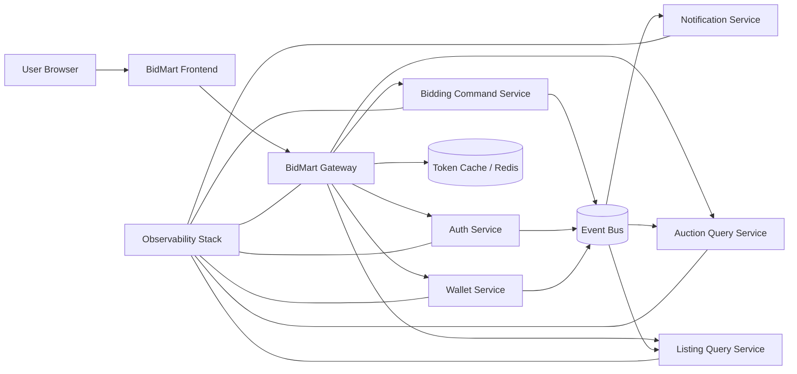
```mermaid
graph LR
    U[User Browser] --> FE[BidMart Frontend]
    FE --> GW[BidMart Gateway]

    GW --> AUTH[Auth Service]
    GW --> AQS[Auction Query Service]
    GW --> LQS[Listing Query Service]
    GW --> BCS[Bidding Command Service]
    GW --> WLT[Wallet Service]

    GW --> RC[(Token Cache / Redis)]

    BCS --> BUS[(Event Bus)]
    AUTH --> BUS
    WLT --> BUS

    BUS --> NTF[Notification Service]
    BUS --> AQS
    BUS --> LQS

    OBS[Observability Stack] --- GW
    OBS --- AUTH
    OBS --- BCS
    OBS --- WLT
    OBS --- AQS
    OBS --- LQS
    OBS --- NTF
```

### 2.3 Penjelasan Perubahan dari Current ke Future Architecture
1. **Current:** banyak alur masih sinkron dan saling tunggu antar service.  
   **Future:** event bus dipakai untuk proses notifikasi dan update read model agar alur utama lelang tidak tertahan.

2. **Current:** gateway meneruskan request ke banyak service tanpa cache token context.  
   **Future:** token cache di gateway mengurangi call validasi berulang ke auth service.

3. **Current:** tracing belum terstandar lintas service.  
   **Future:** semua service wajib kirim metrics, trace ID, dan log terstruktur sehingga debugging insiden lebih cepat.

4. **Current:** risiko duplikasi efek pada operasi finansial ketika retry.  
   **Future:** operasi sensitif (hold/release/capture/top-up) menggunakan idempotency key.

---

## Bagian 3 - Risk Storming

### 3.1 Kenapa Risk Storming Digunakan
Risk storming digunakan karena sistem BidMart punya banyak dependency antar service yang bisa gagal secara berantai saat skala pengguna naik. Dengan teknik ini, tim bisa mengidentifikasi risiko dari sisi teknis, operasional, dan data consistency lebih awal, lalu memetakan mitigasinya langsung ke desain arsitektur future.

Risk storming juga efektif untuk menyamakan prioritas tim. Kita tidak hanya membahas fitur, tetapi juga failure mode paling kritis yang berpotensi menyebabkan kerugian user, terutama pada alur autentikasi, bidding, dan wallet.

### 3.2 Risiko yang Ditemukan
1. **Single point pressure di Gateway dan Auth Service** saat traffic login atau validasi token tinggi.
2. **Cascading failure** karena dependency sinkron bidding -> wallet -> query/notification.
3. **Inconsistency saldo/wallet** jika request retry mengeksekusi operasi finansial lebih dari sekali.
4. **Observability lemah** sehingga akar masalah sulit ditemukan ketika insiden lintas service terjadi.
5. **Event delivery tidak konsisten** untuk update notifikasi dan read model.

### 3.3 Risiko Paling Penting
Risiko paling penting adalah **inconsistency transaksi finansial (wallet hold/release/capture)** karena dampaknya langsung ke kepercayaan user dan potensi kerugian saldo.

### 3.4 Bagaimana Future Architecture Mengurangi Risiko
- Menambahkan **idempotency key** untuk semua command finansial agar retry tidak menggandakan efek transaksi.
- Memindahkan proses notifikasi dan update read model ke **event bus** untuk mengurangi blocking pada alur utama.
- Menambahkan **token cache** di gateway agar Auth Service tidak menjadi bottleneck saat lonjakan request.
- Mewajibkan **metrics + distributed tracing + structured logging** untuk mempercepat investigasi insiden.

---

## Individual Works

### Dimas Abyan Diasta - 2406432633 - Autentifikasi dan Manajemen Pengguna

### Individual Container Diagram (Auth dan User Management)
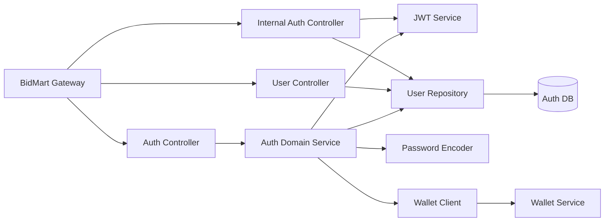
```mermaid
graph LR
    GW[BidMart Gateway] --> AC[Auth Controller]
    GW --> UC[User Controller]
    GW --> IAC[Internal Auth Controller]

    AC --> ADS[Auth Domain Service]
    IAC --> JS[JWT Service]
    IAC --> UR[User Repository]
    UC --> UR

    ADS --> UR
    ADS --> PE[Password Encoder]
    ADS --> JS
    ADS --> WC[Wallet Client]

    UR --> ADB[(Auth DB)]
    WC --> WS[Wallet Service]
```

### Code Diagram 1 - Register Flow
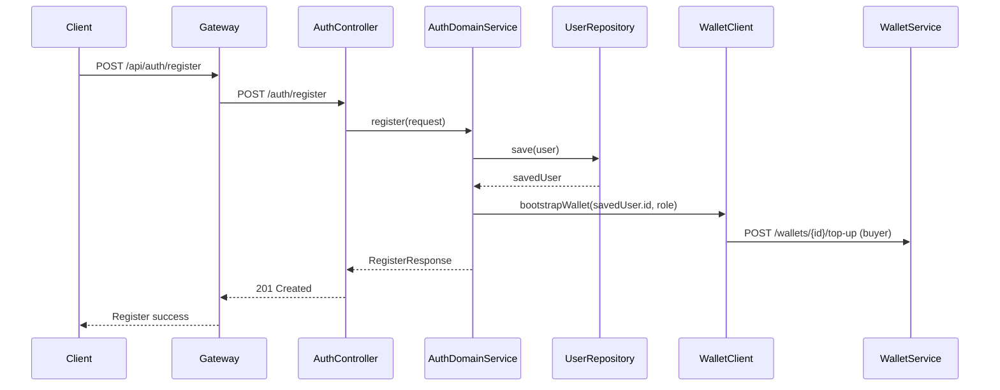
```mermaid
sequenceDiagram
    participant Client
    participant Gateway
    participant AuthController
    participant AuthDomainService
    participant UserRepository
    participant WalletClient
    participant WalletService

    Client->>Gateway: POST /api/auth/register
    Gateway->>AuthController: POST /auth/register
    AuthController->>AuthDomainService: register(request)
    AuthDomainService->>UserRepository: save(user)
    UserRepository-->>AuthDomainService: savedUser
    AuthDomainService->>WalletClient: bootstrapWallet(savedUser.id, role)
    WalletClient->>WalletService: POST /wallets/{id}/top-up (buyer)
    AuthDomainService-->>AuthController: RegisterResponse
    AuthController-->>Gateway: 201 Created
    Gateway-->>Client: Register success
```

### Code Diagram 2 - Login dan JWT Issuance
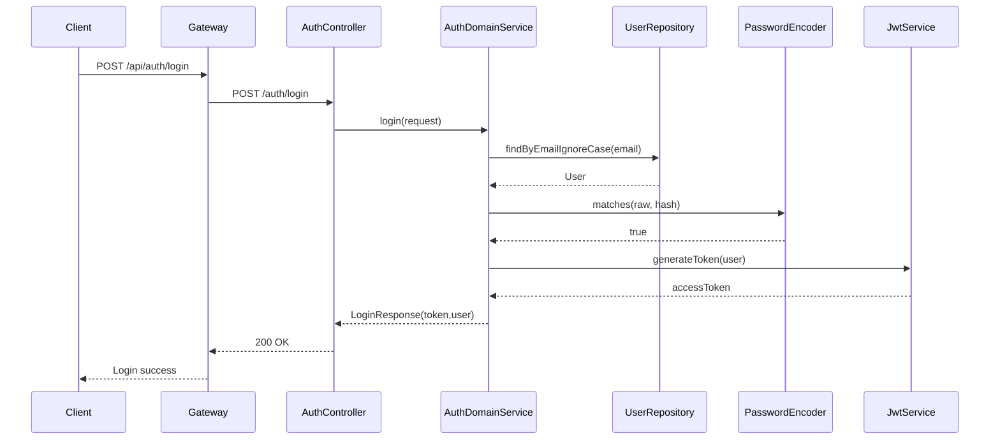
```mermaid
sequenceDiagram
    participant Client
    participant Gateway
    participant AuthController
    participant AuthDomainService
    participant UserRepository
    participant PasswordEncoder
    participant JwtService

    Client->>Gateway: POST /api/auth/login
    Gateway->>AuthController: POST /auth/login
    AuthController->>AuthDomainService: login(request)
    AuthDomainService->>UserRepository: findByEmailIgnoreCase(email)
    UserRepository-->>AuthDomainService: User
    AuthDomainService->>PasswordEncoder: matches(raw, hash)
    PasswordEncoder-->>AuthDomainService: true
    AuthDomainService->>JwtService: generateToken(user)
    JwtService-->>AuthDomainService: accessToken
    AuthDomainService-->>AuthController: LoginResponse(token,user)
    AuthController-->>Gateway: 200 OK
    Gateway-->>Client: Login success
```

### Code Diagram 3 - `/auth/me` dan Pengambilan Saldo
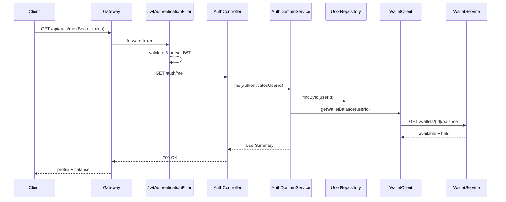
```mermaid
sequenceDiagram
    participant Client
    participant Gateway
    participant JwtFilter as JwtAuthenticationFilter
    participant AuthController
    participant AuthDomainService
    participant UserRepository
    participant WalletClient
    participant WalletService

    Client->>Gateway: GET /api/auth/me (Bearer token)
    Gateway->>JwtFilter: forward token
    JwtFilter->>JwtFilter: validate & parse JWT
    Gateway->>AuthController: GET /auth/me
    AuthController->>AuthDomainService: me(authenticatedUser.id)
    AuthDomainService->>UserRepository: findById(userId)
    AuthDomainService->>WalletClient: getWalletBalance(userId)
    WalletClient->>WalletService: GET /wallets/{id}/balance
    WalletService-->>WalletClient: available + held
    AuthDomainService-->>AuthController: UserSummary
    AuthController-->>Gateway: 200 OK
    Gateway-->>Client: profile + balance
```

### Code Diagram 4 - Internal Token Validation dan Permission Lookup
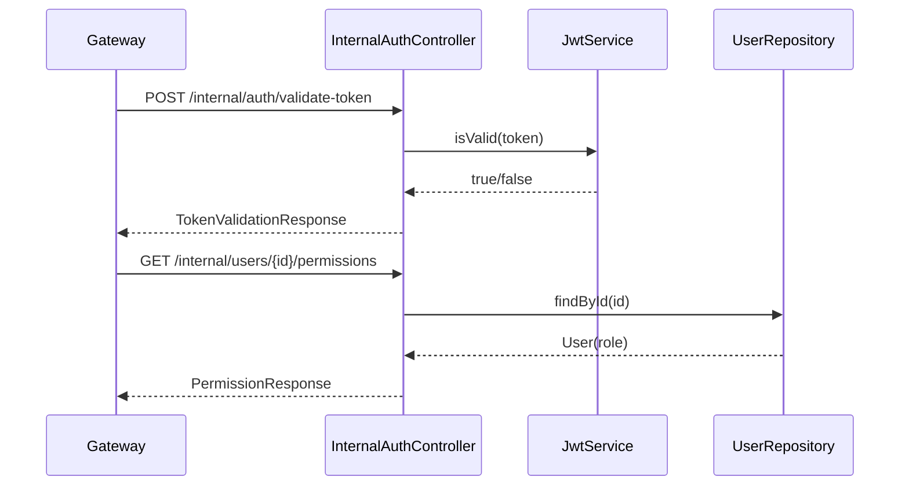
```mermaid
sequenceDiagram
    participant Gateway
    participant InternalAuthController
    participant JwtService
    participant UserRepository

    Gateway->>InternalAuthController: POST /internal/auth/validate-token
    InternalAuthController->>JwtService: isValid(token)
    JwtService-->>InternalAuthController: true/false
    InternalAuthController-->>Gateway: TokenValidationResponse

    Gateway->>InternalAuthController: GET /internal/users/{id}/permissions
    InternalAuthController->>UserRepository: findById(id)
    UserRepository-->>InternalAuthController: User(role)
    InternalAuthController-->>Gateway: PermissionResponse
```

### Muhammad Azka Awliya - 2406431510 - Lelang dan Penawaran

### Individual Container Diagram - Bidding Command Service

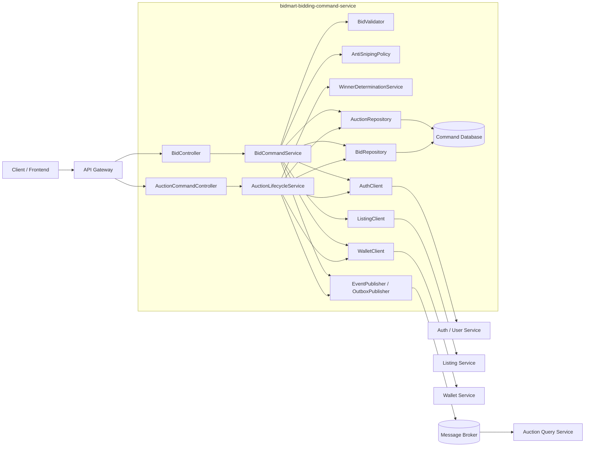
```mermaid
flowchart LR
    Client[Client / Frontend]
    Gateway[API Gateway]

    subgraph BiddingCommandService[bidmart-bidding-command-service]
        BidController[BidController]
        AuctionCommandController[AuctionCommandController]

        BidCommandService[BidCommandService]
        AuctionLifecycleService[AuctionLifecycleService]

        BidValidator[BidValidator]
        AntiSnipingPolicy[AntiSnipingPolicy]
        WinnerDeterminationService[WinnerDeterminationService]

        AuctionRepository[AuctionRepository]
        BidRepository[BidRepository]

        WalletClient[WalletClient]
        ListingClient[ListingClient]
        AuthClient[AuthClient]

        EventPublisher[EventPublisher / OutboxPublisher]

        CommandDB[(Command Database)]
    end

    AuthService[Auth / User Service]
    ListingService[Listing Service]
    WalletService[Wallet Service]
    MessageBroker[(Message Broker)]
    AuctionQueryService[Auction Query Service]

    Client --> Gateway
    Gateway --> BidController
    Gateway --> AuctionCommandController

    BidController --> BidCommandService
    AuctionCommandController --> AuctionLifecycleService

    BidCommandService --> AuthClient
    BidCommandService --> ListingClient
    BidCommandService --> WalletClient
    BidCommandService --> BidValidator
    BidCommandService --> AntiSnipingPolicy
    BidCommandService --> AuctionRepository
    BidCommandService --> BidRepository
    BidCommandService --> EventPublisher

    AuctionLifecycleService --> AuthClient
    AuctionLifecycleService --> WinnerDeterminationService
    AuctionLifecycleService --> AuctionRepository
    AuctionLifecycleService --> BidRepository
    AuctionLifecycleService --> WalletClient
    AuctionLifecycleService --> EventPublisher

    AuthClient --> AuthService
    ListingClient --> ListingService
    WalletClient --> WalletService

    AuctionRepository --> CommandDB
    BidRepository --> CommandDB

    EventPublisher --> MessageBroker
    MessageBroker --> AuctionQueryService
```

### Code Diagram 1 - Place Bid / Membuat Penawaran

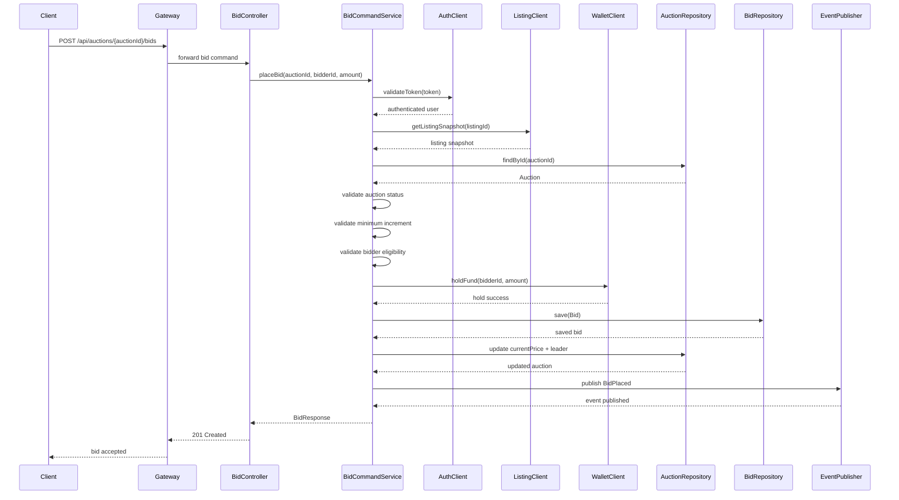
```mermaid
sequenceDiagram
    participant Client
    participant Gateway
    participant BidController
    participant BidCommandService
    participant AuthClient
    participant ListingClient
    participant WalletClient
    participant AuctionRepository
    participant BidRepository
    participant EventPublisher

    Client->>Gateway: POST /api/auctions/{auctionId}/bids
    Gateway->>BidController: forward bid command
    BidController->>BidCommandService: placeBid(auctionId, bidderId, amount)

    BidCommandService->>AuthClient: validateToken(token)
    AuthClient-->>BidCommandService: authenticated user

    BidCommandService->>ListingClient: getListingSnapshot(listingId)
    ListingClient-->>BidCommandService: listing snapshot

    BidCommandService->>AuctionRepository: findById(auctionId)
    AuctionRepository-->>BidCommandService: Auction

    BidCommandService->>BidCommandService: validate auction status
    BidCommandService->>BidCommandService: validate minimum increment
    BidCommandService->>BidCommandService: validate bidder eligibility

    BidCommandService->>WalletClient: holdFund(bidderId, amount)
    WalletClient-->>BidCommandService: hold success

    BidCommandService->>BidRepository: save(Bid)
    BidRepository-->>BidCommandService: saved bid

    BidCommandService->>AuctionRepository: update currentPrice + leader
    AuctionRepository-->>BidCommandService: updated auction

    BidCommandService->>EventPublisher: publish BidPlaced
    EventPublisher-->>BidCommandService: event published

    BidCommandService-->>BidController: BidResponse
    BidController-->>Gateway: 201 Created
    Gateway-->>Client: bid accepted
```

### Code Diagram 2 - Anti-Sniping Extension

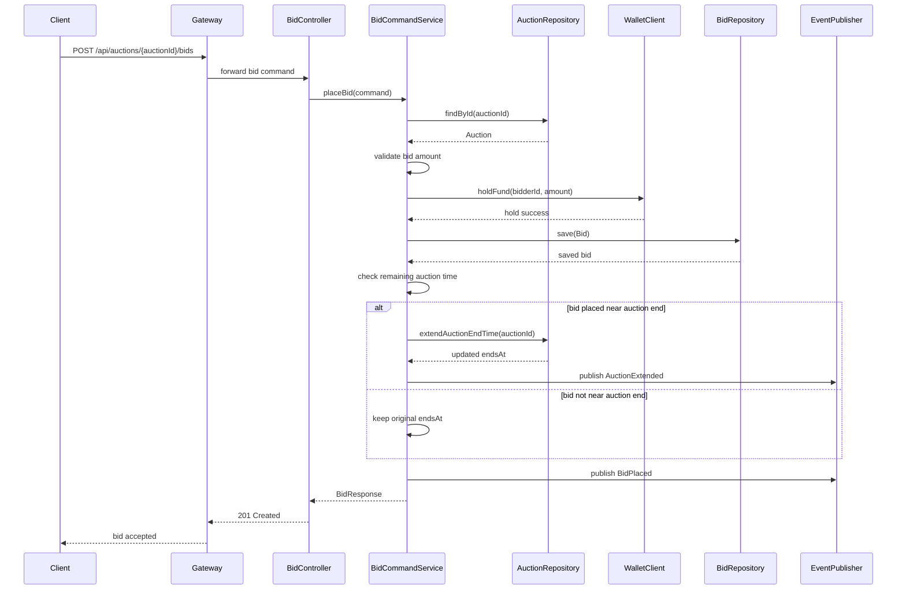
```mermaid
sequenceDiagram
    participant Client
    participant Gateway
    participant BidController
    participant BidCommandService
    participant AuctionRepository
    participant WalletClient
    participant BidRepository
    participant EventPublisher

    Client->>Gateway: POST /api/auctions/{auctionId}/bids
    Gateway->>BidController: forward bid command
    BidController->>BidCommandService: placeBid(command)

    BidCommandService->>AuctionRepository: findById(auctionId)
    AuctionRepository-->>BidCommandService: Auction

    BidCommandService->>BidCommandService: validate bid amount
    BidCommandService->>WalletClient: holdFund(bidderId, amount)
    WalletClient-->>BidCommandService: hold success

    BidCommandService->>BidRepository: save(Bid)
    BidRepository-->>BidCommandService: saved bid

    BidCommandService->>BidCommandService: check remaining auction time

    alt bid placed near auction end
        BidCommandService->>AuctionRepository: extendAuctionEndTime(auctionId)
        AuctionRepository-->>BidCommandService: updated endsAt
        BidCommandService->>EventPublisher: publish AuctionExtended
    else bid not near auction end
        BidCommandService->>BidCommandService: keep original endsAt
    end

    BidCommandService->>EventPublisher: publish BidPlaced
    BidCommandService-->>BidController: BidResponse
    BidController-->>Gateway: 201 Created
    Gateway-->>Client: bid accepted
```

### Code Diagram 3 - Close Auction dan Menentukan Pemenang

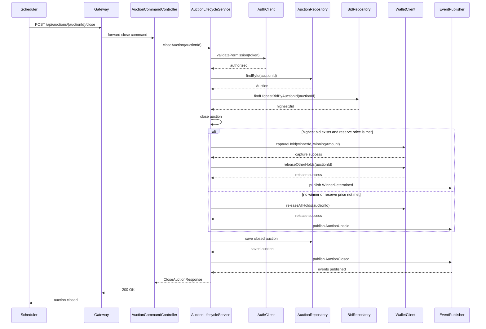
```mermaid
sequenceDiagram
    participant Scheduler
    participant Gateway
    participant AuctionCommandController
    participant AuctionLifecycleService
    participant AuthClient
    participant AuctionRepository
    participant BidRepository
    participant WalletClient
    participant EventPublisher

    Scheduler->>Gateway: POST /api/auctions/{auctionId}/close
    Gateway->>AuctionCommandController: forward close command
    AuctionCommandController->>AuctionLifecycleService: closeAuction(auctionId)

    AuctionLifecycleService->>AuthClient: validatePermission(token)
    AuthClient-->>AuctionLifecycleService: authorized

    AuctionLifecycleService->>AuctionRepository: findById(auctionId)
    AuctionRepository-->>AuctionLifecycleService: Auction

    AuctionLifecycleService->>BidRepository: findHighestBidByAuctionId(auctionId)
    BidRepository-->>AuctionLifecycleService: highestBid

    AuctionLifecycleService->>AuctionLifecycleService: close auction

    alt highest bid exists and reserve price is met
        AuctionLifecycleService->>WalletClient: captureHold(winnerId, winningAmount)
        WalletClient-->>AuctionLifecycleService: capture success
        AuctionLifecycleService->>WalletClient: releaseOtherHolds(auctionId)
        WalletClient-->>AuctionLifecycleService: release success
        AuctionLifecycleService->>EventPublisher: publish WinnerDetermined
    else no winner or reserve price not met
        AuctionLifecycleService->>WalletClient: releaseAllHolds(auctionId)
        WalletClient-->>AuctionLifecycleService: release success
        AuctionLifecycleService->>EventPublisher: publish AuctionUnsold
    end

    AuctionLifecycleService->>AuctionRepository: save closed auction
    AuctionRepository-->>AuctionLifecycleService: saved auction

    AuctionLifecycleService->>EventPublisher: publish AuctionClosed
    EventPublisher-->>AuctionLifecycleService: events published

    AuctionLifecycleService-->>AuctionCommandController: CloseAuctionResponse
    AuctionCommandController-->>Gateway: 200 OK
    Gateway-->>Scheduler: auction closed
```

### Code Diagram 4 - Cancel Auction

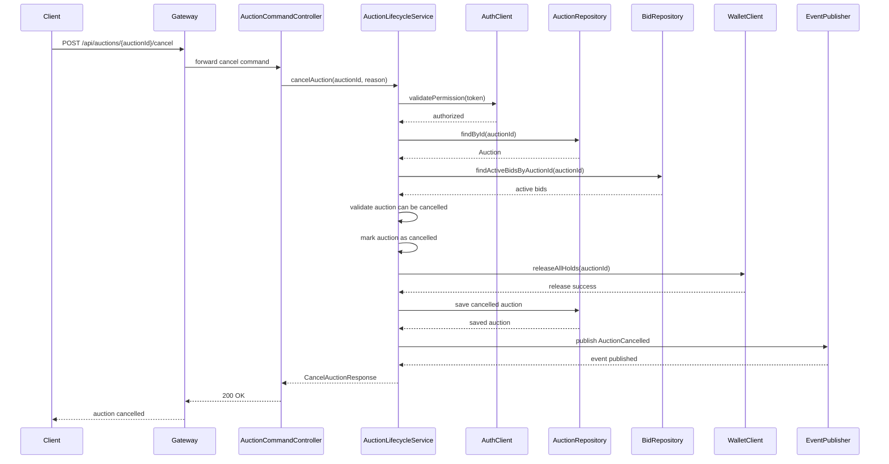
```mermaid
sequenceDiagram
    participant Client
    participant Gateway
    participant AuctionCommandController
    participant AuctionLifecycleService
    participant AuthClient
    participant AuctionRepository
    participant BidRepository
    participant WalletClient
    participant EventPublisher

    Client->>Gateway: POST /api/auctions/{auctionId}/cancel
    Gateway->>AuctionCommandController: forward cancel command
    AuctionCommandController->>AuctionLifecycleService: cancelAuction(auctionId, reason)

    AuctionLifecycleService->>AuthClient: validatePermission(token)
    AuthClient-->>AuctionLifecycleService: authorized

    AuctionLifecycleService->>AuctionRepository: findById(auctionId)
    AuctionRepository-->>AuctionLifecycleService: Auction

    AuctionLifecycleService->>BidRepository: findActiveBidsByAuctionId(auctionId)
    BidRepository-->>AuctionLifecycleService: active bids

    AuctionLifecycleService->>AuctionLifecycleService: validate auction can be cancelled
    AuctionLifecycleService->>AuctionLifecycleService: mark auction as cancelled

    AuctionLifecycleService->>WalletClient: releaseAllHolds(auctionId)
    WalletClient-->>AuctionLifecycleService: release success

    AuctionLifecycleService->>AuctionRepository: save cancelled auction
    AuctionRepository-->>AuctionLifecycleService: saved auction

    AuctionLifecycleService->>EventPublisher: publish AuctionCancelled
    EventPublisher-->>AuctionLifecycleService: event published

    AuctionLifecycleService-->>AuctionCommandController: CancelAuctionResponse
    AuctionCommandController-->>Gateway: 200 OK
    Gateway-->>Client: auction cancelled
```

### Refki Septian - 2406397196 - Wallet Service

### Individual Container Diagram - Wallet Service

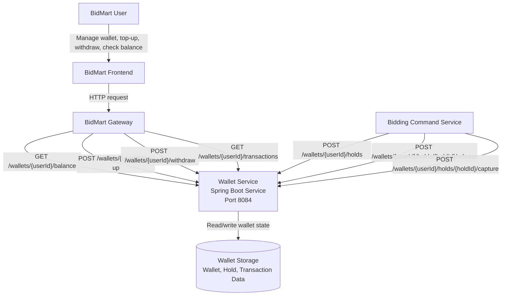
```mermaid
flowchart TB
    User["BidMart User"]
    Frontend["BidMart Frontend"]
    Gateway["BidMart Gateway"]
    BiddingService["Bidding Command Service"]
    
    WalletService["Wallet Service<br/>Spring Boot Service<br/>Port 8084"]
    WalletStorage[("Wallet Storage<br/>Wallet, Hold, Transaction Data")]
    
    User -->|"Manage wallet, top-up, withdraw, check balance"| Frontend
    Frontend -->|"HTTP request"| Gateway
    
    Gateway -->|"GET /wallets/{userId}/balance"| WalletService
    Gateway -->|"POST /wallets/{userId}/top-up"| WalletService
    Gateway -->|"POST /wallets/{userId}/withdraw"| WalletService
    Gateway -->|"GET /wallets/{userId}/transactions"| WalletService
    
    BiddingService -->|"POST /wallets/{userId}/holds"| WalletService
    BiddingService -->|"POST /wallets/{userId}/holds/{holdId}/release"| WalletService
    BiddingService -->|"POST /wallets/{userId}/holds/{holdId}/capture"| WalletService
    
    WalletService -->|"Read/write wallet state"| WalletStorage
```

---

### Code Diagram 1 - Wallet Service Class Structure

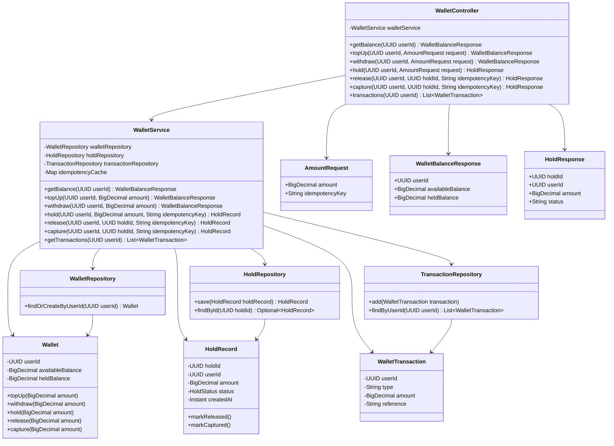
```mermaid
classDiagram
    class WalletController {
        -WalletService walletService
        +getBalance(UUID userId) WalletBalanceResponse
        +topUp(UUID userId, AmountRequest request) WalletBalanceResponse
        +withdraw(UUID userId, AmountRequest request) WalletBalanceResponse
        +hold(UUID userId, AmountRequest request) HoldResponse
        +release(UUID userId, UUID holdId, String idempotencyKey) HoldResponse
        +capture(UUID userId, UUID holdId, String idempotencyKey) HoldResponse
        +transactions(UUID userId) List~WalletTransaction~
    }

    class WalletService {
        -WalletRepository walletRepository
        -HoldRepository holdRepository
        -TransactionRepository transactionRepository
        -Map idempotencyCache
        +getBalance(UUID userId) WalletBalanceResponse
        +topUp(UUID userId, BigDecimal amount) WalletBalanceResponse
        +withdraw(UUID userId, BigDecimal amount) WalletBalanceResponse
        +hold(UUID userId, BigDecimal amount, String idempotencyKey) HoldRecord
        +release(UUID userId, UUID holdId, String idempotencyKey) HoldRecord
        +capture(UUID userId, UUID holdId, String idempotencyKey) HoldRecord
        +getTransactions(UUID userId) List~WalletTransaction~
    }

    class WalletRepository {
        +findOrCreateByUserId(UUID userId) Wallet
    }

    class HoldRepository {
        +save(HoldRecord holdRecord) HoldRecord
        +findById(UUID holdId) Optional~HoldRecord~
    }

    class TransactionRepository {
        +add(WalletTransaction transaction)
        +findByUserId(UUID userId) List~WalletTransaction~
    }

    class Wallet {
        -UUID userId
        -BigDecimal availableBalance
        -BigDecimal heldBalance
        +topUp(BigDecimal amount)
        +withdraw(BigDecimal amount)
        +hold(BigDecimal amount)
        +release(BigDecimal amount)
        +capture(BigDecimal amount)
    }

    class HoldRecord {
        -UUID holdId
        -UUID userId
        -BigDecimal amount
        -HoldStatus status
        -Instant createdAt
        +markReleased()
        +markCaptured()
    }

    class WalletTransaction {
        -UUID userId
        -String type
        -BigDecimal amount
        -String reference
    }

    class AmountRequest {
        +BigDecimal amount
        +String idempotencyKey
    }

    class WalletBalanceResponse {
        +UUID userId
        +BigDecimal availableBalance
        +BigDecimal heldBalance
    }

    class HoldResponse {
        +UUID holdId
        +UUID userId
        +BigDecimal amount
        +String status
    }

    WalletController --> WalletService
    WalletController --> AmountRequest
    WalletController --> WalletBalanceResponse
    WalletController --> HoldResponse

    WalletService --> WalletRepository
    WalletService --> HoldRepository
    WalletService --> TransactionRepository
    WalletService --> Wallet
    WalletService --> HoldRecord
    WalletService --> WalletTransaction

    WalletRepository --> Wallet
    HoldRepository --> HoldRecord
    TransactionRepository --> WalletTransaction
```

Diagram ini menunjukkan struktur utama kode Wallet Service. `WalletController` menjadi REST API layer yang menerima request dari Gateway atau service lain. Controller tidak menyimpan business logic utama, tetapi meneruskan request ke `WalletService`.

`WalletService` menjadi pusat business logic. Di dalam service ini terdapat proses untuk melihat saldo, top-up, withdraw, hold fund, release hold, capture hold, dan mengambil riwayat transaksi. Service ini juga menggunakan `idempotencyCache` untuk menghindari pemrosesan command yang sama secara berulang, terutama pada operasi hold, release, dan capture.

Repository layer digunakan untuk memisahkan akses data dari business logic. `WalletRepository` digunakan untuk mengambil atau membuat data wallet berdasarkan `userId`. `HoldRepository` digunakan untuk menyimpan dan mencari data dana yang sedang ditahan. `TransactionRepository` digunakan untuk mencatat dan mengambil riwayat transaksi wallet.

Model utama dalam service ini adalah `Wallet`, `HoldRecord`, dan `WalletTransaction`. `Wallet` menyimpan saldo tersedia dan saldo tertahan. `HoldRecord` menyimpan status dana yang ditahan, seperti `HELD`, `RELEASED`, atau `CAPTURED`. `WalletTransaction` menyimpan jejak transaksi agar perubahan saldo dapat diaudit.

---

### Code Diagram 2 - Hold Fund Flow

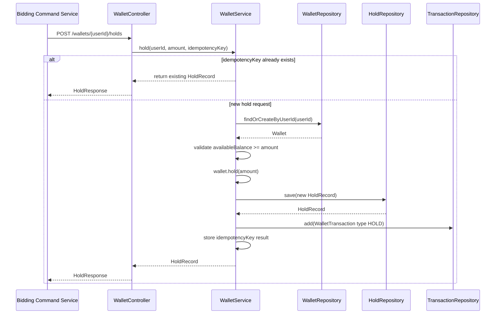
```mermaid
sequenceDiagram
    participant Bidding as Bidding Command Service
    participant Controller as WalletController
    participant Service as WalletService
    participant WalletRepo as WalletRepository
    participant HoldRepo as HoldRepository
    participant TxRepo as TransactionRepository

    Bidding->>Controller: POST /wallets/{userId}/holds
    Controller->>Service: hold(userId, amount, idempotencyKey)

    alt idempotencyKey already exists
        Service-->>Controller: return existing HoldRecord
        Controller-->>Bidding: HoldResponse
    else new hold request
        Service->>WalletRepo: findOrCreateByUserId(userId)
        WalletRepo-->>Service: Wallet

        Service->>Service: validate availableBalance >= amount
        Service->>Service: wallet.hold(amount)

        Service->>HoldRepo: save(new HoldRecord)
        HoldRepo-->>Service: HoldRecord

        Service->>TxRepo: add(WalletTransaction type HOLD)
        Service->>Service: store idempotencyKey result

        Service-->>Controller: HoldRecord
        Controller-->>Bidding: HoldResponse
    end
```

Diagram ini menjelaskan alur ketika Bidding Command Service meminta Wallet Service untuk menahan dana user saat user melakukan bid. Request masuk ke `WalletController`, lalu diteruskan ke `WalletService`.

Pada tahap awal, `WalletService` mengecek apakah `idempotencyKey` sudah pernah diproses. Jika key yang sama sudah ada, service langsung mengembalikan hasil lama. Tujuannya adalah mencegah dana user tertahan dua kali ketika request yang sama dikirim ulang karena retry jaringan.

Jika request merupakan request baru, service mengambil wallet user melalui `WalletRepository`, lalu memvalidasi apakah `availableBalance` cukup. Jika saldo cukup, method `wallet.hold(amount)` dijalankan. Operasi ini mengurangi `availableBalance` dan menambah `heldBalance`.

Setelah itu, service membuat `HoldRecord`, mencatat transaksi bertipe `HOLD`, lalu menyimpan hasilnya ke idempotency cache. Alur ini penting karena proses bidding tidak boleh hanya mengecek saldo, tetapi juga harus memastikan dana benar-benar ditahan agar user tidak menggunakan saldo yang sama untuk transaksi lain.

---

### Code Diagram 3 - Release Hold Flow

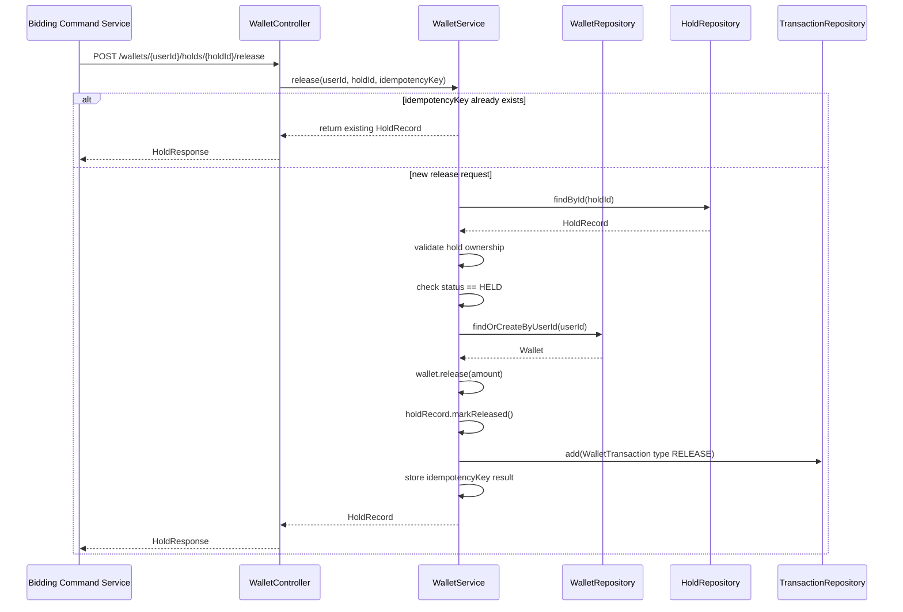
```mermaid
sequenceDiagram
    participant Bidding as Bidding Command Service
    participant Controller as WalletController
    participant Service as WalletService
    participant WalletRepo as WalletRepository
    participant HoldRepo as HoldRepository
    participant TxRepo as TransactionRepository

    Bidding->>Controller: POST /wallets/{userId}/holds/{holdId}/release
    Controller->>Service: release(userId, holdId, idempotencyKey)

    alt idempotencyKey already exists
        Service-->>Controller: return existing HoldRecord
        Controller-->>Bidding: HoldResponse
    else new release request
        Service->>HoldRepo: findById(holdId)
        HoldRepo-->>Service: HoldRecord

        Service->>Service: validate hold ownership
        Service->>Service: check status == HELD

        Service->>WalletRepo: findOrCreateByUserId(userId)
        WalletRepo-->>Service: Wallet

        Service->>Service: wallet.release(amount)
        Service->>Service: holdRecord.markReleased()
        Service->>TxRepo: add(WalletTransaction type RELEASE)
        Service->>Service: store idempotencyKey result

        Service-->>Controller: HoldRecord
        Controller-->>Bidding: HoldResponse
    end
```

---

### Code Diagram 4 - Capture Hold Flow

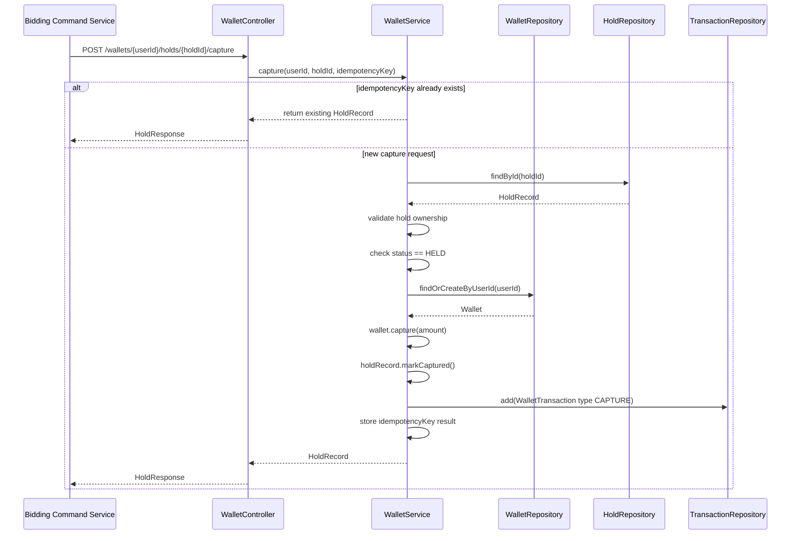
```mermaid
sequenceDiagram
    participant Bidding as Bidding Command Service
    participant Controller as WalletController
    participant Service as WalletService
    participant WalletRepo as WalletRepository
    participant HoldRepo as HoldRepository
    participant TxRepo as TransactionRepository

    Bidding->>Controller: POST /wallets/{userId}/holds/{holdId}/capture
    Controller->>Service: capture(userId, holdId, idempotencyKey)

    alt idempotencyKey already exists
        Service-->>Controller: return existing HoldRecord
        Controller-->>Bidding: HoldResponse
    else new capture request
        Service->>HoldRepo: findById(holdId)
        HoldRepo-->>Service: HoldRecord

        Service->>Service: validate hold ownership
        Service->>Service: check status == HELD

        Service->>WalletRepo: findOrCreateByUserId(userId)
        WalletRepo-->>Service: Wallet

        Service->>Service: wallet.capture(amount)
        Service->>Service: holdRecord.markCaptured()
        Service->>TxRepo: add(WalletTransaction type CAPTURE)
        Service->>Service: store idempotencyKey result

        Service-->>Controller: HoldRecord
        Controller-->>Bidding: HoldResponse
    end
```

---
